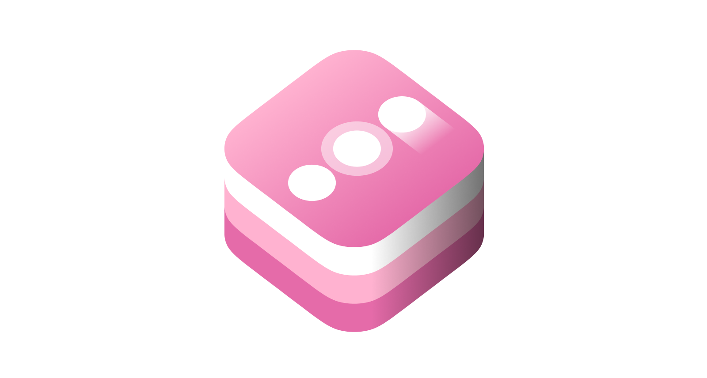

<h1 align="center" style="margin-top: 0px;">UIKitActions</h1>

<div align = "center">
  <a href="https://cocoapods.org/pods/uikit-actions">
    
  </a>
  <a href="https://github.com/incetro/uikit-actions#installation">
    
  </a>
  <a href="https://cocoapods.org/pods/uikit-actions" target="blank">
    
  </a>
  <a href="https://cocoapods.org/pods/uikit-actions" target="blank">
    
  </a>
  <br>
  <br>
</div>

**uikit-actions** provides a set of extensions to add closures to `UIView` and `UIControl` instances. Also brings some methods to `UIBarButtonItem` and `UIGestureRecognizer`, that allow using them with a closure instead of a pair of target/action.

With **uikit-actions**, you will easily add actions this way:

````swift
/// UIView
let imageView = UIImageView()
imageView.add(gesture: .swipe(.Left)) {
    print("Action processing")
}

/// UIControl
let button = UIButton()
button.add(event: .touchUpInside) {
    print("Action processing")
}

/// UITextField
let textField = UITextField()
textField.throttle(.editingChanged, interval: 0.5) { (textField: UITextField) in
    print("Text changed to: \(textField.text)")
}

// UIGestureRecognizer
let gestureRecognizer = UIRotationGestureRecognizer {
    print("Action processing")
}

// UIBarButtonItem
let barButtonItem = UIBarButtonItem(title: "Title") {
    print("Action processing")
}
````

## Installation

### Cocoapods
Add the following to your `Podfile`:

````
pod 'uikit-actions'
````

Then run `pod install`.

And finally, in the classes where you need **uikit-actions**: 

````
import UIKitActions
````

## Usage

## Supported classes
- [UIView](#UIView)
- [UIControl](#UIControl)
- [UIGestureRecognizer](#UIGestureRecognizer)
- [UIBarButtonItem](#UIBarButtonItem)

<a name="UIView"></a>

### UIView

You can make your `UIViews` to respond to simple touches. The allowed gestures are members of the enum `Gestures` and their values are: 

- `tap`: One finger tap, accept one `Int` parameter that indicate the number of required touches. 
- `swipe`: One finger swipe, accept one `UISwipeGestureRecognizer.Direction` parameter that indicate the direction of the swip. 
- `multiTap`: Tap with any number of fingers, accept two `Int` parameter that indicate the number of required fingers and touches. 
- `multiSwipe`: Swipe with any number of fingers; accept one `UISwipeGestureRecognizer.Direction` parameter that indicate the direction of the swip and an `Int` parameter that indicate the number of required fingers and touches.

To add one of this gestures to a `UIView` you can do: 

````swift
let view = UIView()

// Not any gesture argument means .tap(1):
view.addAction {
     print("view tapped")
}

// You can also make the closure have one argument (the own view):
view.addAction { (view: UIView) in
    print("view \(view) tapped")
}

// Add 3 tap gesture
view.add(gesture: .tap(3)) {
    print("View tapped 3 times")
}

// Add a multi swipe gesture with the view as closure argument
view.add(gesture: .multiSwipe(direction: .Left, fingers: 2)) { (view: UIView) in
    print("View \(view) swipped left with 2 fingers")
}
```` 

All the add action methods returns the UIGestureRecognizer added to the view, in case you need it. 

### UIControl

Assign actions to your `UIControl` events. 

You can add three types of closures:

- Without any argument
- With one argument, it will be the control itself.
- With two arguments, the first one will be the control itself, the second one will be the `UIEvent?`.

You can add actions:

- To a single `UIControl.Event`, using the method `add(event: UIControl.Event, action: () -> Void)`
- To multple control events at the same time: `add(events: [UIControl.Event], action: ()) -> Void)`

Here there are some examples:

````swift
// Closure without arguments and single event
button.add(event: .touchUpInside) {
    print("button tapped")
}

// Closure with one argument and multiple events
textField.add(events: [.editingChanged, .editingDidEnd]) { (textField: UITextField) in
    print("Text did change: \(textField.text)")
}

// Closure with two arguments
button.add(event: .touchUpInside) { (sender, event) in
    print("Sender: \(sender), Event: \(event)")
}
````

Actions added using this methods can be removed using the method:

`func removeActions(for events: UIControl.Event)`

> **Note**: Just the actions added using the `Actions` method will be removed!.


#### Throttle
Actions allows `UIControl` schedulling actions to be called after a specific time interval, and prevent it of being called more than once in that interval. In other words, if the action is scheduled again before the time interval expires, it cancels the previous call (if any) preventing the action to be called twice.

A typical example is a `UITextField` which will trigger a search every time the user enter some text. If this search implies a http request, it can lead to overload the server if you make a request every time the user enter a character. With `throttle` you can wait a few milliseconds to check if the user is still typing and just send the action if the user hasn't entered any character in a time interval. 

You can use throttle this way: 

````swift
textField.throttle(.editingChanged, interval: 0.5) { [unowned self] (textField: UITextField) in
    self.performSearch(with: textField.text)
}
````

Other than the `UIControl` extension, the `Throttle` class can be used standalone to add your custom throttles all over your app. 

<a name="UIGestureRecognizer"></a>

### UIGestureRecognizer

Create `UIGestureRecognizer` with a closure instead of a pair of target/action:

````swift
// without argument
let recognizer = UIRotationGestureRecognizer {
    print("Gesture triggered")
}

// with argument
let recognizer = UIRotationGestureRecognizer { (recognizer: UIRotationGestureRecognizer) in
    print("Gesture \(recognizer) triggered")
}
````

<a name="UIBarButtonItem"></a>

### UIBarButtonItem

Create `UIBarButtonItem` with a closure instead of a pair of target/action. You can create bar button items from its title, image or using a system type:

````swift
let imageTitle = UIBarButtonItem(image: image) {
    print("image item pressed")
}

let titleItem = UIBarButtonItem(title: "Title") {
    print("title item pressed")
}

let systemItem = UIBarButtonItem(barButtonSystemItem: .action) {
    print("system item pressed")
}
````

All these methods has some additional, optional arguments. They also can be used with closures that takes the `UIBarButtonItem` as an argument, for instance: 

````swift
let imageTitle = UIBarButtonItem(image: image) { (item: UIBarButtonItem) in
    print("image item \(item) pressed")
}
````

## License

uikit-actions is available under the [MIT license](LICENSE.md).
